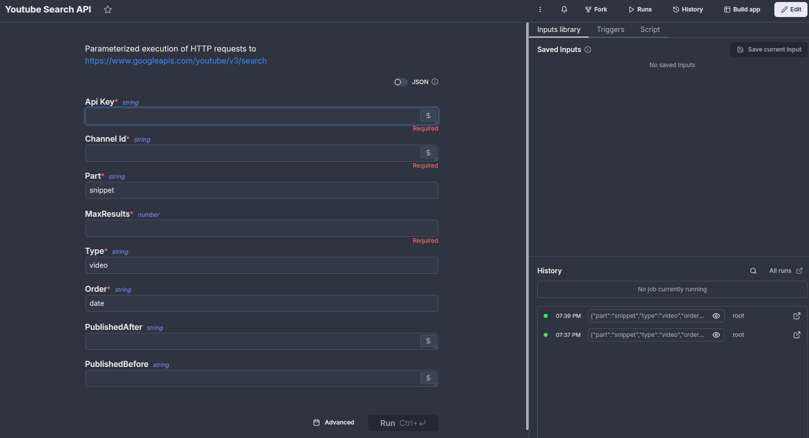

# Post on 2025-03-19 19:40:22

Today I have been putting together a backend for the new tonka site on the Windmill instance I set up end of last week. I also did a bunch of discovery on how I plan to style the accompanying storefront, which will be in some shadcn-based way.

Here is an example of how writing a bit of code in windmill gives you a UI for parameterized requests to the [YouTube Data API v3](https://developers.google.com/youtube/v3/docs/search).
