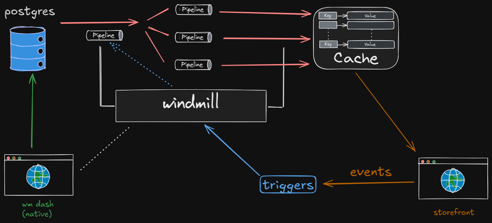

# Something I wish more people understood about data

I made this venn diagram to illustrate a data problem often encountered in the backend of ecommerce operations.

How does one solve this?

I've seen the process called ETL, ELT, and many other names, but basically consists of the following:

1. Store the data in one place exactly how it comes in
2. Store the data how you need it in another place
3. Write pipelines between the two databases
4. Build a system to manage the triggers

Windmill is absolutely incredible for this.

I want to have a Postgres serve as the main source of truth and the database that contains the data owned and input by back office. A dashboard, which I hope can be a mill app running in an electron shell, will serve as a data entry point. Pipelines are activated to ETL this data into a Redis "cache" which will actually serve as the primary database accessed by the storefront.

### Easy to draft

I like that by using the postgres instance _we_ interact with as a source of truth for data which is then transformed into use-specific data, we can setup operations such that drafting everything from design ideas to entire products is easy, since new pipelines are easy to add and the process doesn't change.

### Flexible

Given we are careful to prioritize input validation to the postgres, the workflow is simple yet allows for flexibility since as long as information ends up in the cache according to the schema dictated by its use case (the storefront). We are never "jamming" data into the storefront or into any of our databases, since we just perform operation on it and have a copy of it at the start and end of each operation.

## Event-driven

Buzz word but whatever, I like when business operations work one way, I don't care what that way is. But to say that "in order for data to change, some known and explicitly handled event must occur" is a very neat way to handle things in practice.

I'm going to go work on this some more this evening...
