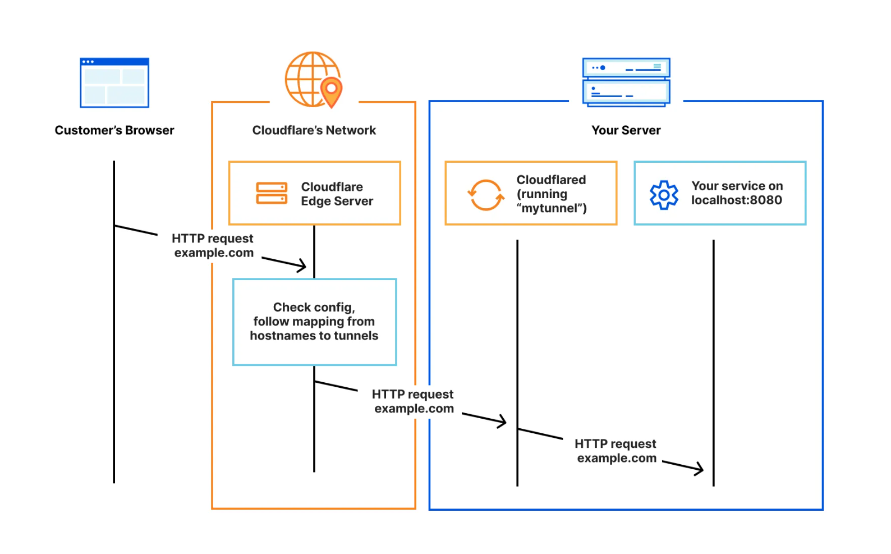
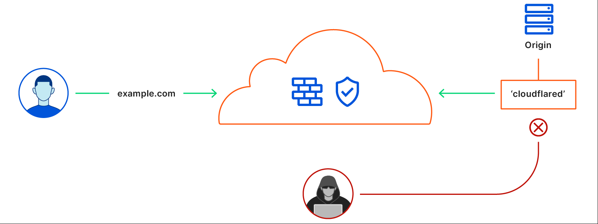

**Let's say you've got a friend willing to grant you access to a Proxmox node in their homelab.**

For a long time, the most likely course of action would have been to reverse proxy a port on his homelab's network and forward it to the Proxmox host:8006. Nowadays it's just a fact that there are more secure ways to do this.

# Cloudflare Tunnels

I love these. They are free and allow you to securely expose services in a private network through private tunnels to a proxy, with quite a bit of granularity.

There are two things you get from Cloudflare:

1. A proxy server
2. A daemon program to run on the machine you want hosted

Instead of traditionally managing the proxy yourself (e.g. nginx reverse proxy), you can offload that responsiblity onto a Cloudflare server, and associate a DNS record with it - the one you want to point to your locally hosted service.

Then, you install `cloudflared` on the local machine and run one simple `cloudflared service` command with a key used to connect to the proxy server. Once this happens, there is a private tunnel established between the two machines, and you can choose a protocol and address:port on the local network where to exactly where the service is located, e.g. `localhost:8006`. The result works as follows:

# Why is this better than reverse proxies?

Simple - with this setup, absolutely nothing on your homelab network is directly exposed to the internet. No ports are forwarded. There is no massive attack vector being exposed:

Additionally, Cloudflare lets you set up authentication layers on the proxy and it's shockingly easy to do. For instance, on many of my subdomains, your requests don't get forwarded to the machine on the other side of the proxy unless you authenticate with an auth provider hosted on Cloudflare via GitHub OAuth login. A session token is dispatched which you can then use for the duration of the application session.

This way there is yet _another_ layer of protection that makes it impossible for an attacker to even determine any information about the target machine like IP or hostname.
