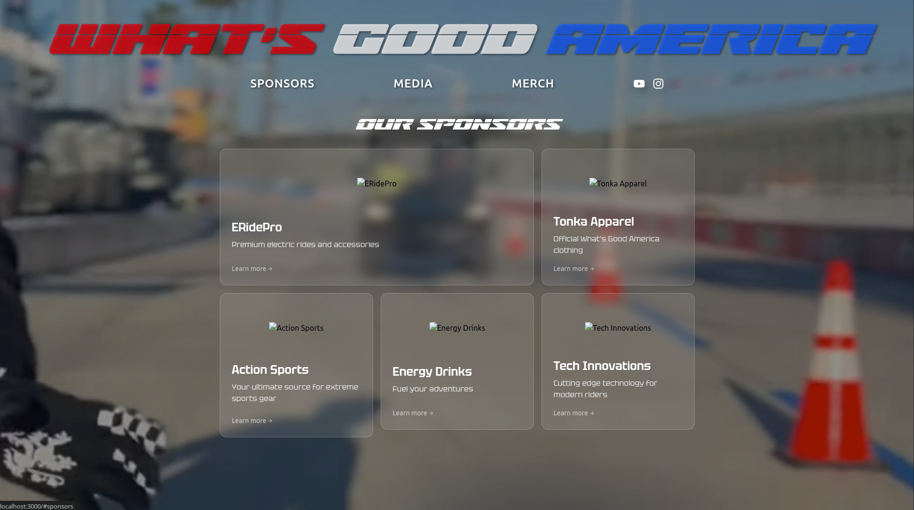
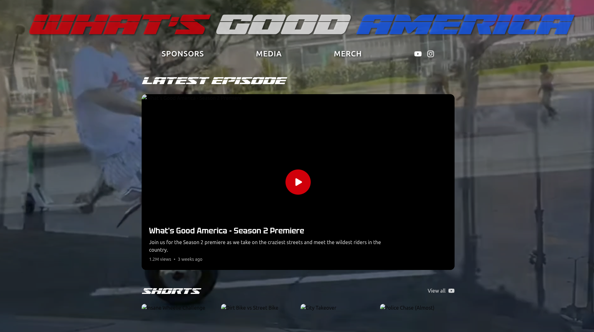

The site for bigtonk.com is in this state with a bunch of lorem ipsum placeholders and missing images:

Off the top of my head, I need to:

1. Tweak placeholder data models
2. Put that stuff in a database
3. Write and host a lil API for it
4. Add a functional cart
5. Customers/Auth
6. Reimplement stripe
7. Media page: make shorts a grid of actual YT embeds

These are decent goals for this week.
