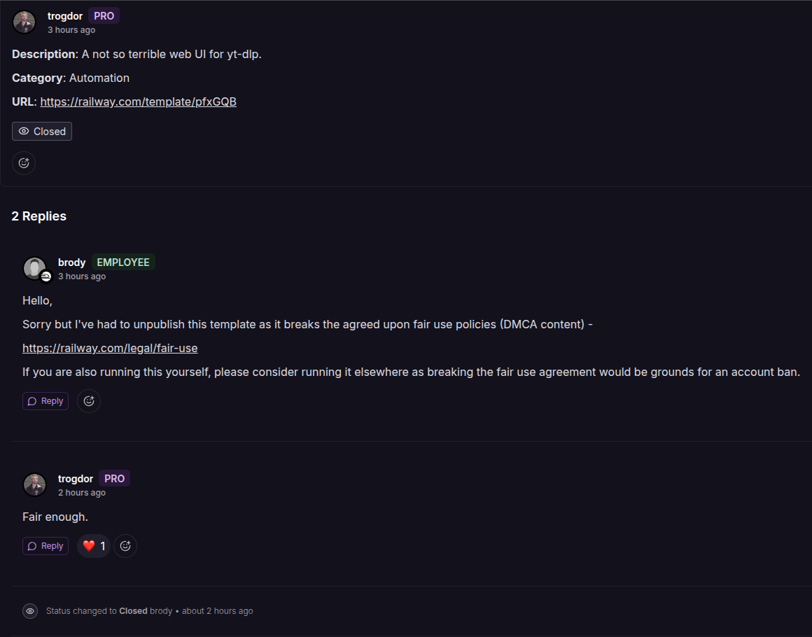

<i>brody almost bans me for some DMCA bullshit or something.</i>

Other than that, I've made a <a href="https://railway.com/template/5M2-4G">FluidCalendar</a> template and am continuing to work on some others.

Karakeep was good until I get weird deployment errors after trying to create a project from the template. "Invalid patch payload" non-descriptive error crap from railway dash.

Continuing on currently with FileFlows then GoMFT, Seafile, CryptPad, Plant-it, Paperless, InvenTree, and others.
