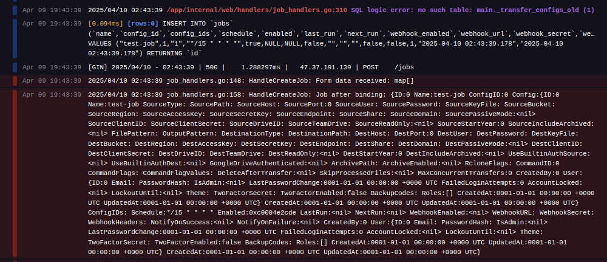

It deploys.

When following <a href="https://github.com/StarFleetCPTN/GoMFT#usage">these instructions</a>, I get to step 5 before the create job function fails silently. I get a 500 in the console, and see this in the Railway logs:

:o

Another on on the TODO.

Side note FileFlows requires a docker socket volume mount which AFAIK still isn't supported on railway.
