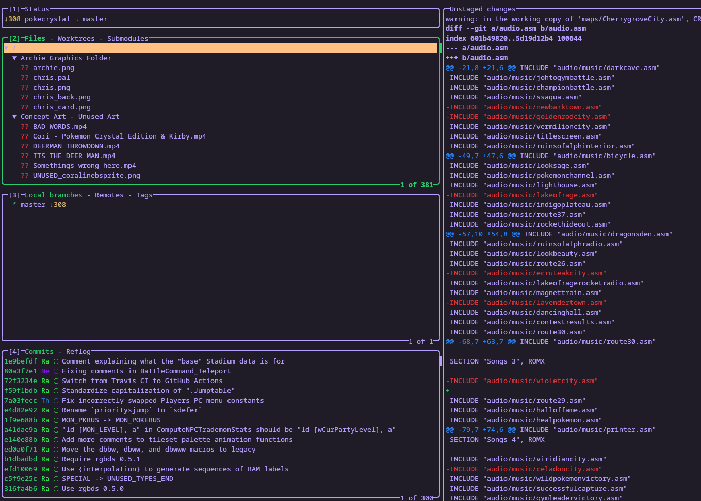

I had a friend ask if I could help diff out the code of a modified Pokemon GBC game to figure out what they did. I was given the known source (a git repo) and a 7z containing the git repo of the mod source (and last built binaries).

Upon extracting the mod source, I noticed that it was the same original git repo with all the changes just left untracked. This at least lets us see, albeit without any context, the changes that were made.

I figured that to make sense of the changes, it would first make sense to get a build pipeline going so we can fiddle with the modded parts we don't understand and see the effects. The build didn't require anything weird (git, gcc, bison) except for [rgbds](https://rgbds.gbdev.io/), a GameBoy Color modding framework. It is [well documented](https://rgbds.gbdev.io/docs/v0.9.1).

After an initail build, `make` spit out an error about an invalid `rgbds` flag, `-L`. Removing the flag in the makefile rendered uglier-looking compile errors.

I noticed that the last commit to the existing code was made in mid-2021, so I matched up rgbds versions according to the latest at that time, built `rgbds` from source, then ran the Makefile against that version. Success!

Next I will fiddle with the code and start to make sense of the assembly changes, so I can add some context missing from them currently.
