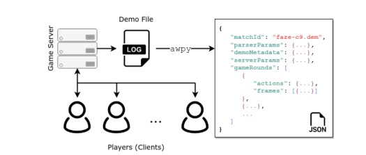

I am not a math guy. But some papers I have read recently have me deciphering math notation I don't understand and trying to get a handle of statistics. Parsing CS demos into useable data en masse has become my new latest project.

Many papers on this topic have been written by [Peter Xenopolous](https://scholar.google.com/citations?user=F-JeV_kAAAAJ&hl=en). Most of them are within the context of CS:GO, and I am deeply motivated to replicate as much of his research as I can in CS2.

There is a particularly interesting dataset, [esta](https://github.com/pnxenopoulos/esta), that introduces a huge array of strategic opportunity for teams and opens up a whole data ecosystem within CS.

**My first task** is to write a competent, reliable parser for top-x team demos on [hltv](https://hltv.org).
