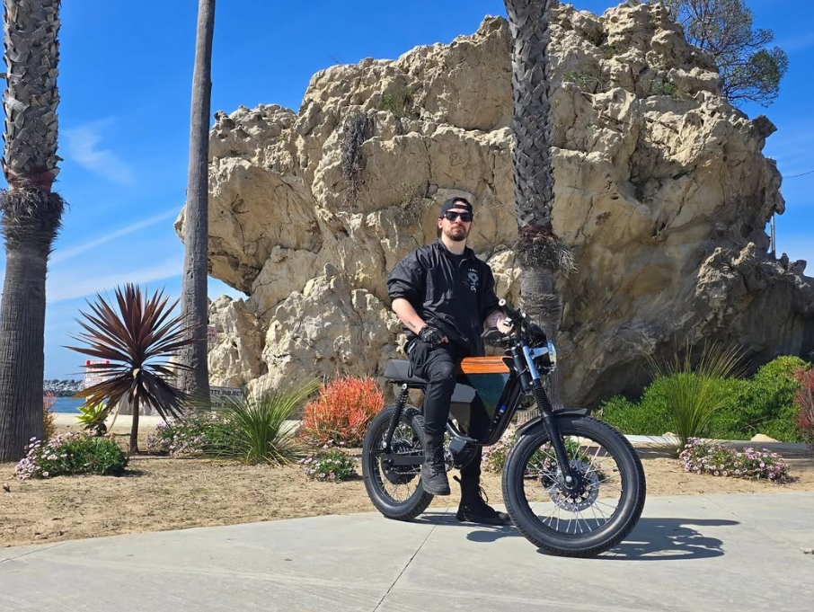

I've been a personal electric vehicle (PEV) enthusaist for several years. In fact, I don't own a car, but instead, several e-bikes and electric motorcycles. My daily driver is an Onyx RCR, a 72v, 8kw hub-driven electric "bike" that gets up to 70mph in under 5 seconds.

<i>My RCR LTD, #47/100 of the individually numbered bikes from 2024.</i>

These bikes use a Kelly Controllers KLS7230S, which in oversimplified terms, acts as a valve between the battery and the motor, controlling how much current is applied to the motor based on the throttle position. There are currently no truly good ways to configure these controllers - there are only a couple of difficult, clunky ways to do so. This is a common need for RCR owners as most will want to tweak settings like dead zones, max current limits, timing values, and many other characteristics about the bike's drivetrain.

Another common need is to monitor values from a BMS (Battery Management System), such as individual cell voltages or temperature sensors. This is more difficult to pin down, as there is a greater variety of BMS chips installed in aftermarket batteries, a common RCR modification. However, all of the stock batteries ship with the same BMS.

<i>The guts of one of my earlier RCR's. The Kelly KLS7230S is visible mounted on the bottom of the battery tray. Dominating the top half of the frame is an (aftermarket) 60ah 72v battery pack, 20 series of Samsung 50s Li-ion 18650 cells.</i>

I have offered my time to Onyx Motors to investigate the feasability of shipping a first-party mobile application for free with the bike, to manage both controller configuration and BMS monitoring.

Some important things I want to remember today:

- <a href="https://media.kellycontroller.com/new/Kelly-Cheetah-series-KLS-SUserManualV2.12-1.pdf">More recent KLS7230S manual</a>
- Uses RS232 Serial protocol
- Controller comes with 4-pin JST adapter installed for RS232 communication
- Controller comes with OPTIONAL CAN bus that is not set up but availabe on the harness
- Bikes come with installed 4-pin JST to BLE adapter
- <a href="https://www.electricvelocitypnw.com/product/kelly-programming-cable">4-pin JST to USB cable</a> (for serial connection to PC)

I have to use something like nRF Connect to sniff the services on the BLE adapter. It is translating the BLE messages into serial messages on the RS232 protocol. I think sniffing this is a lot easier than trying to log and reverse-engineer the serial protocol itself. I do have documentation on the CAN protocol, but this doesn't help me at all for making a mobile app to configure the controller. If the bike already has working BLE communication to the controller, sniffing and finding patterns in the messages when inputting or reading configuration values is the next step.

If deciphering the BLE messages is too difficult, I plan to purchase the JST to USB cable and log those signals on a PC.

UPDATE 07/16/25:

What I did so far today was to take an Android device, put it in developer mode, and enable BT HCI logging while I use the AC Aduser app to execute commands on the Kelly controller. I then used `adb` to retrieve the logs and open them in Wireshark on my PC.

They came in as a `.cfa` file, which I don't know anything about, however Wireshark opened it just fine and exposed a bunch of Bluetooth RCOMM and SPP packets worth investigating.

UPDATE 07/27/25:

I have converted this initial post about BLE HCI snooping the AC Aduser app into a superpost that I will keep updating however long this goes on for.
