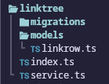
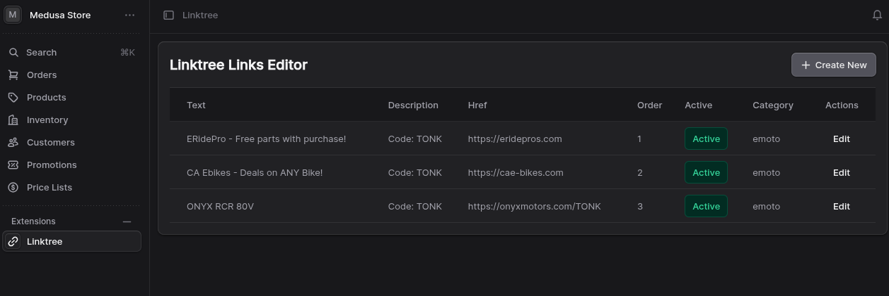

Not too long ago I released <a href="https://bigtonk.com">this site</a> to consolidate several services under one platform for the owner. Things like Linktree, Patreon, Shopify, etc...all services that take a cut and have their own entire ecosystem you have to keep track of.

In recent days I have discovered how extensible <a href="https://medusajs.com/">MedusaJS</a> is. There is a well-documented and fairly robust way to add data models to the Medusa database:



The files above are all you need to get CRUD-ready services powered by Mikro-ORM, which you don't have to write anything for except data models and extend a service class with those.

From there, you can write "workflows", which are just functions with access to the Medusa container - their name for the dependency injection container - with full access to your generated services. These workflows can contain multiple "steps", each with their own rollback logic to run on failure:

```ts
import { InferTypeOf } from "@medusajs/framework/types";
import Linkrow from "../modules/linktree/models/linkrow";
import {
  createStep,
  createWorkflow,
  StepResponse,
  WorkflowResponse,
} from "@medusajs/framework/workflows-sdk";
import LinkTreeModuleService from "modules/linktree/service";
import { LINKTREE_MODULE } from "modules/linktree";

type LinkTreeRow = InferTypeOf<typeof Linkrow>;

export type CreateLinkrowWorkflowInput = Omit<
  LinkTreeRow,
  "id" | "created_at" | "updated_at" | "deleted_at" | "photo" | "tags"
>;

const createLinkrowStep = createStep(
  "create-linkrow",
  async (linkrowInput: CreateLinkrowWorkflowInput, { container }) => {
    const linktreeModuleService: LinkTreeModuleService =
      container.resolve(LINKTREE_MODULE);

    const linkrow = await linktreeModuleService.createLinkrows({
      ...linkrowInput,
    });

    return new StepResponse(linkrow, linkrow);
  },
  async (linkrow, { container }) => {
    const linktreeModuleService: LinkTreeModuleService =
      container.resolve(LINKTREE_MODULE);

    await linktreeModuleService.deleteLinkrows(linkrow.id);
  },
);

export const createLinkrowWorkflow = createWorkflow(
  "create-linkrow",
  (linkrowInput: CreateLinkrowWorkflowInput) => {
    const linkrow = createLinkrowStep(linkrowInput);

    return new WorkflowResponse(linkrow);
  },
);
```

These workflows can then be called from elsewhere in the application, such as API routes, scheduled jobs, or internal event handlers (of which there are many).

An example of calling the above workflow from a custom API endpoint:

```ts
import type { MedusaRequest, MedusaResponse } from "@medusajs/framework/http";
import {
  createLinkrowWorkflow,
  CreateLinkrowWorkflowInput,
} from "../../../workflows/create-linkrow";
import { ContainerRegistrationKeys } from "@medusajs/framework/utils";

export async function POST(
  req: MedusaRequest<CreateLinkrowWorkflowInput>,
  res: MedusaResponse,
) {
  const input = req.body;
  const { result: linkrow } = await createLinkrowWorkflow(req.scope).run({
    input,
  });

  res.json({
    linkrow,
  });
}

export async function GET(req: MedusaRequest, res: MedusaResponse) {
  const query = req.scope.resolve(ContainerRegistrationKeys.QUERY);

  const { data: linkrows } = await query.graph({
    entity: "linkrow",
    fields: [
      "id",
      "text",
      "description",
      "href",
      "order",
      "active",
      "category",
    ],
  });

  res.json({ linkrows });
}
```

I then call this API endpoint from a custom route added to the admin UI, on a page which I then use to manage the linktree links in the same place I manage products, customers, and everything else. It's all in one database cluster together, super fast, and super accessible to both the frontend and for back office purposes.

The custom page:



---

I am now about half-done with doing this process for the Youtube video showcase on the site as well. I made the models, service, etc, am writing a workflow now, which I intend to call not from an API route this time but from a scheduled job, to replace the same thing I have running on a Railway function worker and talking to a separate database.
