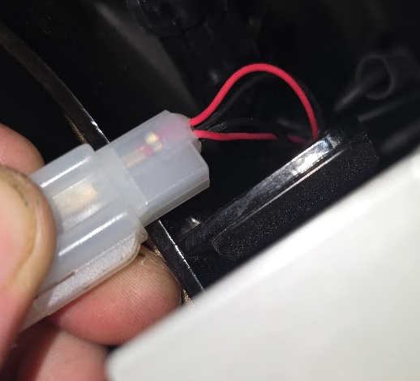

I intend to detail in a later post my journey from enthusiastic [ONYX](https://onyxmotors.com) rider to the company's service manager. For today, I hope to resurrect this blog with some planning details for a black box I am building to help reverse-engineer useful diagnostic information from the bike.

# Preliminary

The 80v RCR is a bike I work on daily. The developer contracted with our company who makes the controller software is not willing to share an API or any documentation with me. So, I am preparing to sniff the existing "programming" leads with a logic analyzer to write my own scripts to dump whatever serial data I can find. From there I will begin the arduous process of decoding these bits into usable information.

**The goal is a plug-and-play system that records unified diagnostics in real time.**

# Preparations

I have purchased the following components for this project:

- [ESP32 boards](https://www.amazon.com/dp/B0F5QCK6X5?ref=ppx_yo2ov_dt_b_fed_asin_title)
- [5v to 3.3v logic converters](https://www.amazon.com/dp/B07F7W91LC?ref=ppx_yo2ov_dt_b_fed_asin_title)
- [24hz 8 channel logic analyzer](https://www.amazon.com/dp/B0FKGN3JMZ?ref=ppx_yo2ov_dt_b_fed_asin_title)
- [ESP32 SD hats](https://www.amazon.com/dp/B0BV8ZQ81F?ref=ppx_yo2ov_dt_b_fed_asin_title)
- [ADUM3160 usb isolator](https://www.amazon.com/dp/B0DNMMXS5D?ref=ppx_yo2ov_dt_b_fed_asin_title)
- [breadboard supplies](https://www.amazon.com/dp/B0BVZBTP8V?ref=ppx_yo2ov_dt_b_fed_asin_title)
- [ferrite rings](https://www.amazon.com/dp/B0CSXZWGD6?ref=ppx_yo2ov_dt_b_fed_asin_title)
- [back probing meter leads](https://www.amazon.com/dp/B07GNVFL5D?ref=ppx_yo2ov_dt_b_fed_asin_title)

# Concept

The original idea was to have the logic analyzer passively dump data to the ESP32 which would record the output to a microSD. These dump files would then be analyzed in [PulseView](https://sigrok.org/wiki/PulseView), a Qt-based GUI for [sigrok](https://sigrok.org/wiki/Main_Page). From here I would hope to find familiar serial data, looking for things like `0x55` start of frame, `0x3A` ":", `0x7E` etc. These signals could be used for anything from peripheral/lighting controls to dump logging for diagnostics.

# First Roadblock - Protocol Identification

<i>Is this UART? LIN? CAN? Something custom? Only the most persistent asshole will find out.</i>

The line labeled "Programmer" has some interesting characteristics. Multiple signals to one pin indicates some kind of duplex UART or CAN bus-like topology. Thoughts:

- Measuring ohm resistance across the two pins to see if 60 or 120 reads, indicating standard CAN network, which use two 120-ohm resistors in parallel.
- Measuring voltage between the two pins, and confirming 5v or 3.3v
- Checking continuity between controller ground (heatsink) and harness pins
- Checking continuity between pins (maybe these just jump for activating BT?)
- Pulseview the data from a positive wire and look for square waves.

I think I am looking either at GND/DATA or CAN-high and CAN-low. Tomorrow I will begin probing to find out. From there I will be sigrok-ing every signal that comes off those pins.
